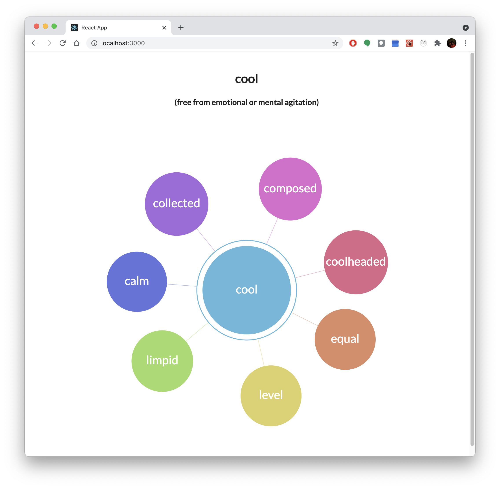
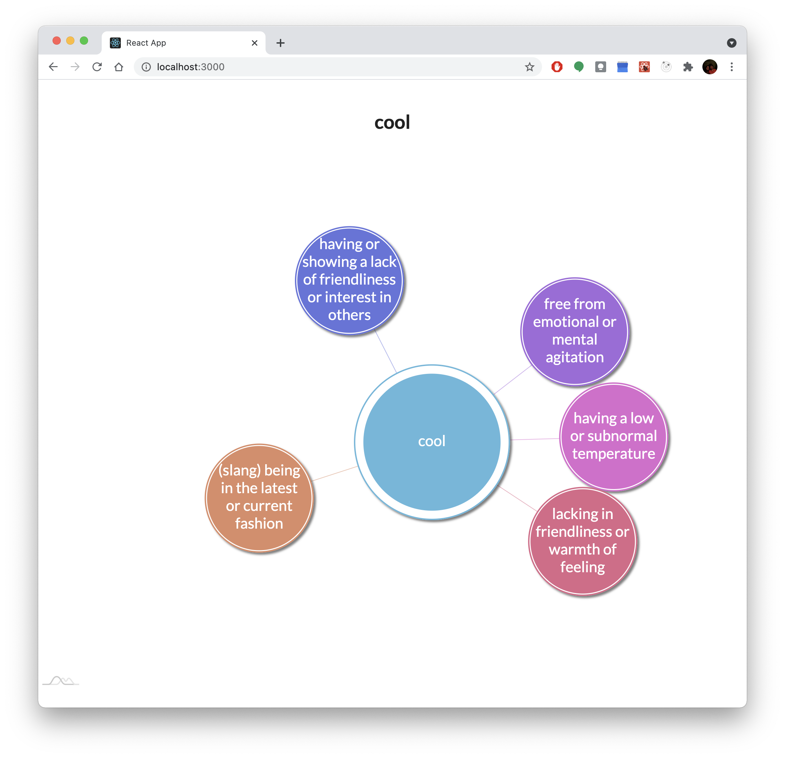
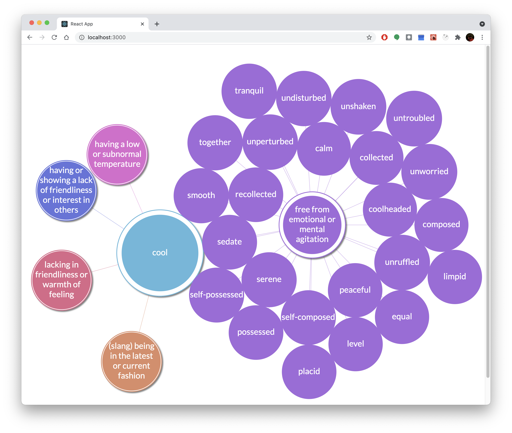
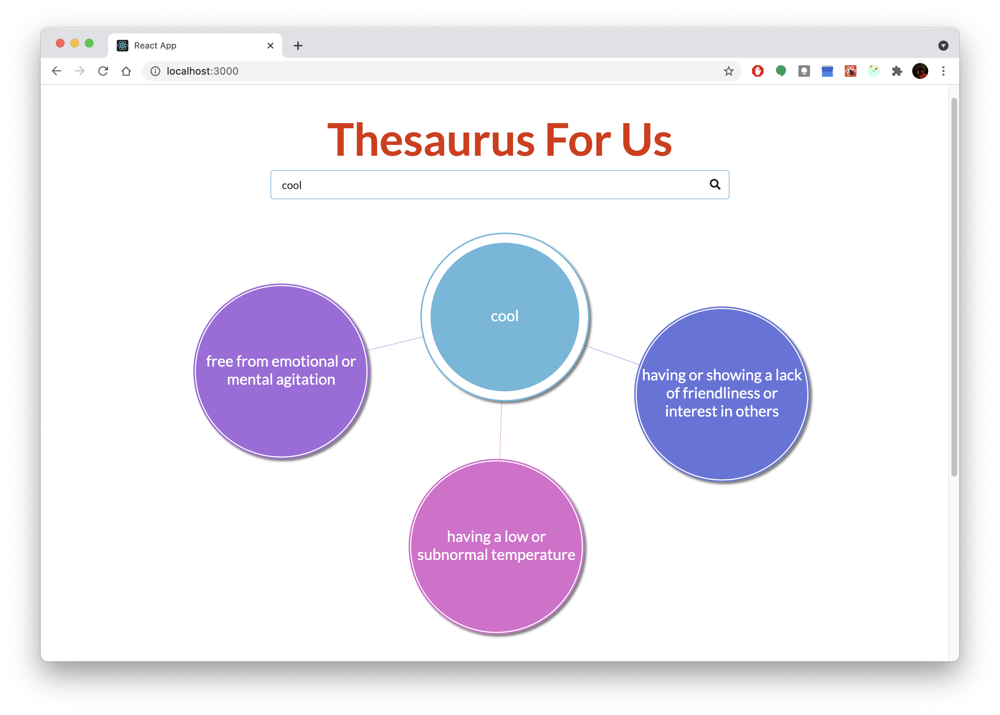

# Thesaurus Web App: Answering the question of how to show the relationships between a word and its synonyms

## Rochelle Roberts Crain

## Description

Thesaurus in a fun visual form. I found myself using a thesaurus daily for many thing, writing emails, my resume, and naming in code. This app offers another way to look at how synonyms grow from one word.

## Software Design & Implementation

Early Planning

- I am inspired by how Apple Watch designed their app drawer view to show all the apps by zooming in and out.
- My plan is to use the CSS function `scale()` to have this effect when rendering a growing number of bubbles representing synonyms of a given word.
- Challenges:
  - rendering the right circle elements in the right spot
  - showing the different word meaning/sense
  - crowding of possible synonyms
  - maybe showing related words
  - searching for new words easily

 

 

 

---

Proof of Concept:
Using [amCharts](https://www.amcharts.com/docs/v4/) to build a tree graph, I successfully generated a graph with sample word data.

   

   
    

     

---

Now that I know how to make a basic graph, I can move on to more complex graph behavior. For example:

- How will the graph grow?
- How can users select the sense or definition of their search word?

---

Handling Multiple senses of a word:

- At first I thought to have a tree for each sense and tabs for users to nav there. But there are some drawbacks to this approach:
  - tabs do not allow multi-trees view
  - does not make use of the graph's branching off
- Now, rather than selecting a definition by tabbing, the first set of child nodes are the word's definitions. This has a few benefits:

  - user can choose to see as many definitions of a word and the associated synonyms
  - make it clear that each sense of a word might have very different meanings (can see in the example of "cool")
  - this approach makes use of more amChart features

   

   
    

     

---

Zooming

- Original plan was to use css to have the zoom in/out effect.
- Fount amChart has a property for handling this behavior
- When user clicks on a word sense, zoom around that node and expand the child nodes
- [amChart Documentation](https://www.amcharts.com/docs/v4/chart-types/force-directed/#Zooming)
   

   
    

     

---

Merriam-Webster API

- Making calls using secret token
- Where to make the call? Important to limit calls for performance and maintain budget
- Options:
  - In a class component, use `fetch` method in `componentDidMount` then updating state.
  - For functional components, use `fetch` method in `useEffect` hook then update state.
  - React-Redux, make api call in an `action`. This would require a little set up, but I have experience using this library.
- React-Redux is the option I chose because I think it is cleaner than putting everything in a component
- My experience tells me it is easier to maintain React's "single source of truth" rule with Redux

Solution to Integrating API data:

1. How? - figuring out what code I need to write to make a HTTP request

- Initially, the many ways to do HTTP requests were overwhelming: XMLHttpRequest, fetch, Axios, and JQuery
- Through research, I found [this blog](https://levelup.gitconnected.com/all-possible-ways-of-making-an-api-call-in-plain-javascript-c0dee3c11b8b) and also [this one](https://www.smashingmagazine.com/2020/06/rest-api-react-fetch-axios/)
- Axios is the method I chose to make HTTP requests get the synonym data I needed
- Separate getting user input, making call, receiving data, error handling, consuming data

2. Where? When? - Putting the API call somewhere that makes sense

- Make call when HomeView initially rendered and when the search word changes (`headword`)
- `useEffect` hook, invoke dispatch there to start making the request
- `useSelector` for accessing `state.headword`
- Error handling -- request has a start, success and fail action types to handle request outcomes

3. What? - Consuming fetched data

- Transformation -- amCharts expect a specific data shape, need a method to do this work
- Reducers handle transformation
- SynonymTree accesses `state.chartData` to render the tree graph

---

Progress: app components functional, hard-coded data, minimal styling

- Updating repo with screenshot of the app after finishing (version1) the main components: HomeView, SearchBox and SynonymTree
- The next major goal is to get all the components working together
- Additionally, I want to refine the app styling -- more color and fun!
  

  
   

    
