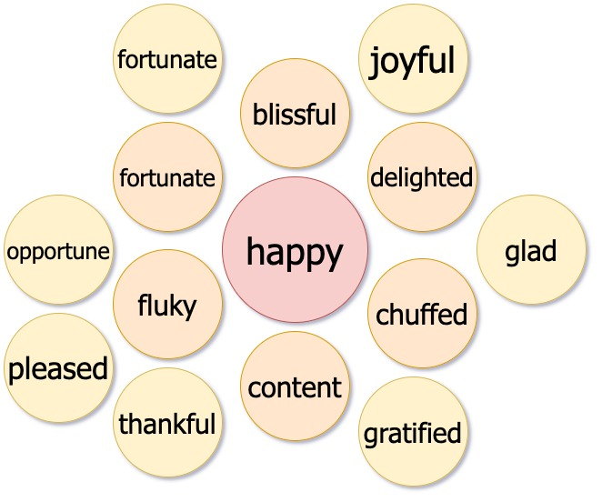

# Thesaurus Web App: Answering the question of how to show the relationships between a word and its synonyms

## Rochelle Roberts Crain

## Description

Thesaurus in a fun visual form. I found myself using a thesaurus daily for many thing, writing emails, my resume, and naming in code. This app offers another way to look at how synonyms grow from one word.

## Software Design

### Planning

I am inspired by how Apple Watch makes use of scale transforms in their app drawer view to show all the apps by zooming in and out. My plan is to use the CSS function `scale()` to have this effect when rendering a growing number of bubbles representing synonyms of a given word.

 

 

 
