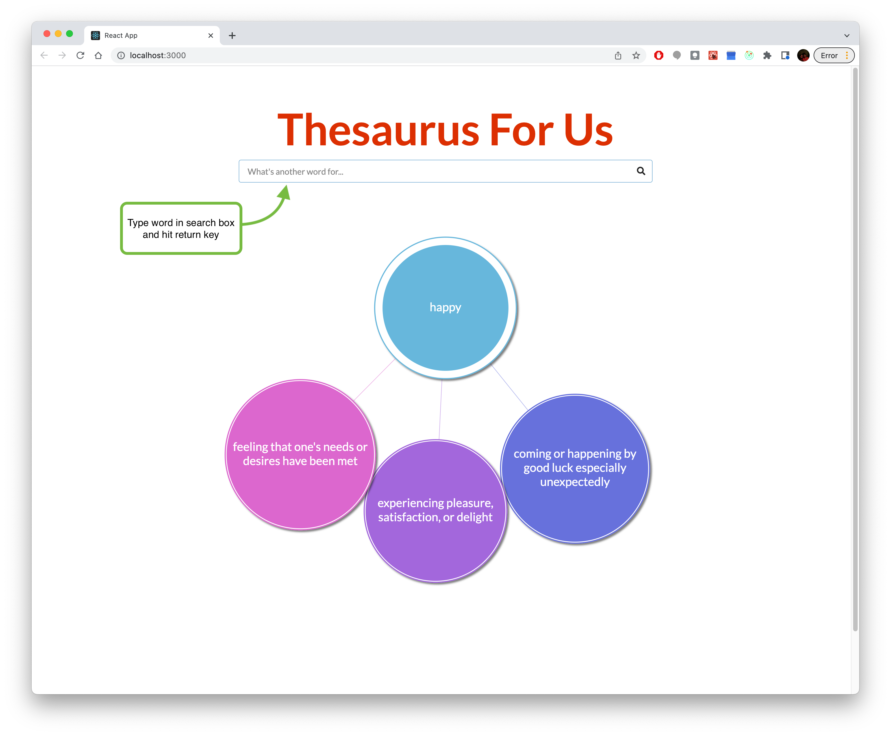

# Thesaurus App: A User Guide

This guide will show users how to use and interact with the Thesaurus App.

#### Notes

- Users do not need familiarity with GitHub or programming to use this guide.
- Internet access required to download repository.
- To "run command" means type the command into console, then hit the `return` key.
- Directory means the folder in your computer **TK:** need more descriptive definition
- See **TK** for more about using console

## Running Thesaurus App Locally

Detailed step-by-step guide for getting the project running. After completing the following steps, Thesaurus App will be running locally and ready to use on the browser.

1. Open console.

2. Be sure to go to a directory that you want to save the project in. For example, documents directory. See TK for more information on how to use console.

3. Clone repo by running the following command:
   `git clone https://github.com/rochellev/thesaurus-app.git`

4. Run the app by running the following command:
   `yarn start`

## Using Thesaurus App

This section assumes that Thesaurus App is running.

### Search for Synonyms

To search for a word, type into the search box. The following is a screenshot of the window you should see.

   
    

     
